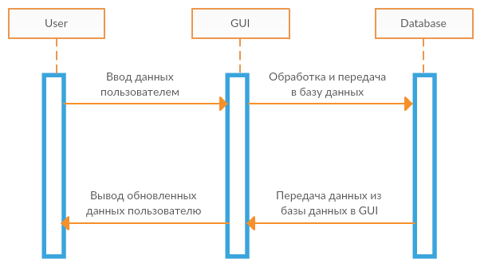
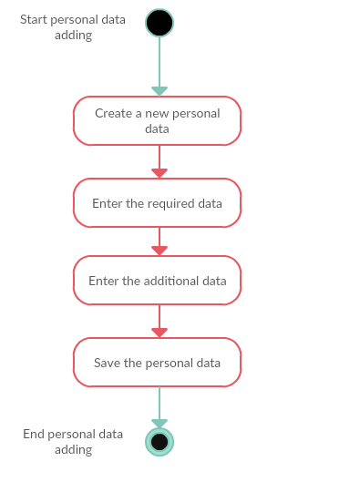
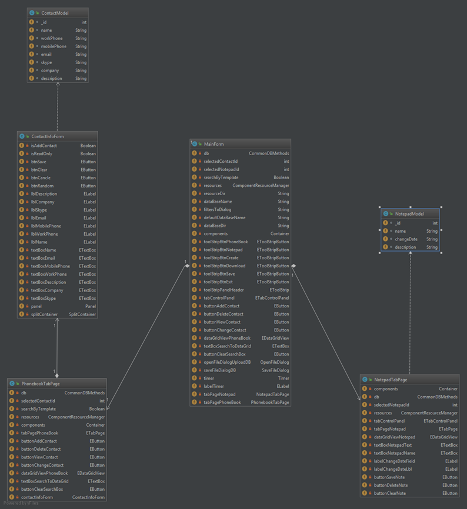

# Содержание
1. [Моделирование динамического поведения системы](#1)  
1.1. [Диаграммы последовательности](#1_1)  
1.2. [Диаграммы активности](#1_2)  
1.3. [Диаграмма состояний товара](#1_3)  
2. [Моделирование статической структуры системы](#2)  
2.1. [Диаграмма классов](#2_1)  
2.2. [Диаграмма компонентов](#2_2)  
2.3. [Диаграмма развёртывания](#2_3)  

<a name="1"/>

#  1. Моделирование динамического поведения системы

<a name="1_1"/>

##  1.1. Диаграммы последовательности

Работа с пользовательскими данными

<a name="1_2"/>

##  1.2. Диаграммы активности

Добавление персональных данных.

Изменение персональных данных.

<a name="1_3"/>

##  1.3. Диаграмма состояний 

<a name="2"/>

#  2. Моделирование статической структуры системы

<a name="2_1"/>

##  2.1. Диаграмма классов

<a name="2_2"/>

##  2.2. Диаграмма компонентов

<a name="2_3"/>

##  2.3. Диаграмма развёртывания

